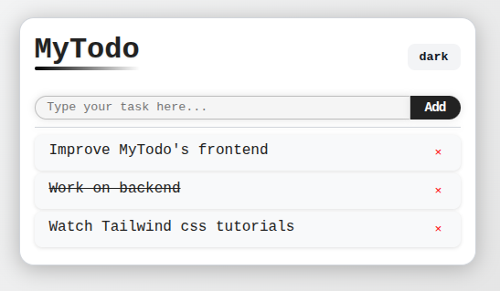
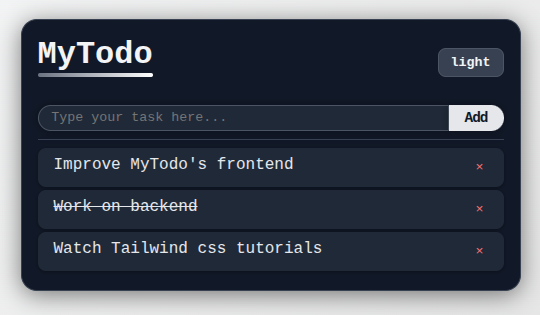

# MyTodo – Simple app to list things to do

A small yet complete to‑do application built with React and TypeScript. It showcases how to combine `useReducer` for state management, Context API for a light/dark theme, and `localStorage` for persistence.

## Preview




## Features
- Add, toggle (done/undone), and delete tasks
- Automatic persistence in `localStorage`
- Light/Dark theme via `ThemeContext` and a toggle button
- Strict TypeScript typing (Task model, reducer actions, Theme)
- Simple and responsive UI

## Tech Stack
- React 18 + Vite
- TypeScript
- Context API (theme) + `useReducer` (tasks)
- `localStorage` (persistence)

## Installation

```bash
# Clone the repository
git clone https://github.com/eren-the-coder/todo-react-app.git
cd todo-react-app

# Install dependencies (choose one)
npm install
# or
yarn
# or
pnpm install
```

## Development

```bash
npm run dev
# or: yarn dev
# or: pnpm dev
```

Open the URL shown in the terminal (usually http://localhost:5173).

## Useful Scripts
- `dev` – start the development server
- `build` – generate the production build
- `preview` – preview the production build locally

## Contributing
Issues and pull requests are welcome. Suggestions for improvements (accessibility, tests, UI, etc.) are appreciated because they would help me improve as a young developer.